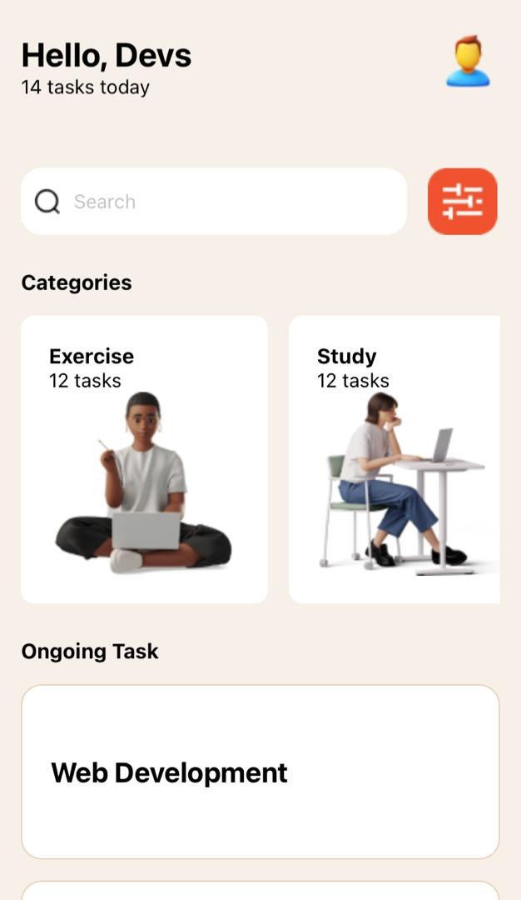

# rn-assignment3-11301995

This repository contains codes for recreating the design as instructed in the UI mockup for the assignment. The application includes  core components and custom components to match the provided UI design.

## Tasks

- Recreate the design as seen in the UI mockup.
- Use at least all the core components:
  - View
  - Text
  - ScrollView
  - TextInput
  - Stylesheet
  - Button
  - FlatList or SectionList for rendering lists of tasks.
  - Image for icons and displaying images

## Components Usage

### Core Components

- View:
  Used as a container for other components to help with layout and styling.

- Text:
  Used to display text within the application.

- ScrollView:
  Allows for scrolling through a long list of items or a large layout.

- TextInput:
  Used for user input, such as entering text.

- Stylesheet:
  Used to style the components consistently throughout the application.

- Button:
  Used to capture user actions, such as submitting a form or navigating to another screen.

- FlatList:
  Used to render lists of tasks efficiently, displaying them in a scrollable view.

- Image:
  Used to display icons and other images within the application.

## Custom Components

Custom components are used throughout the application to ensure modularity and reusability.

The application provides a list of 15 ongoing tasks.

## Styling

The application is styled to closely match the provided UI design. All styles are maintained in the Stylesheet to ensure consistency and ease of maintenance.

